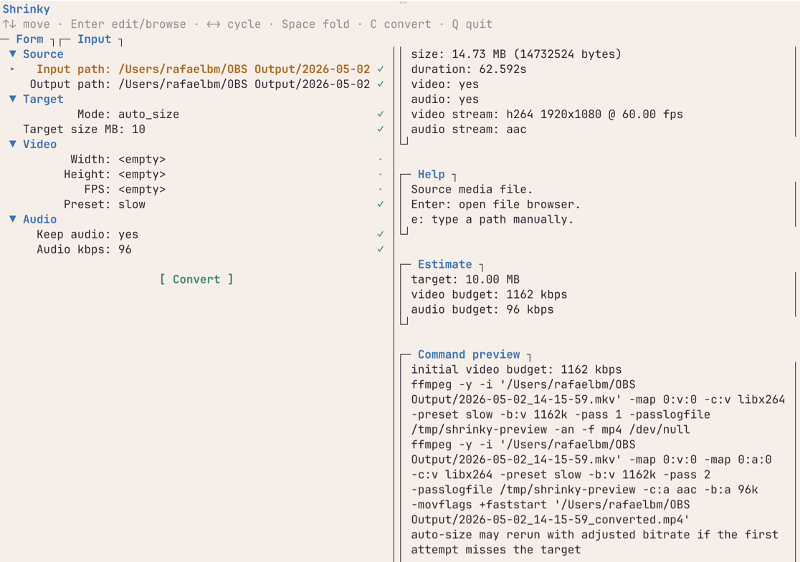
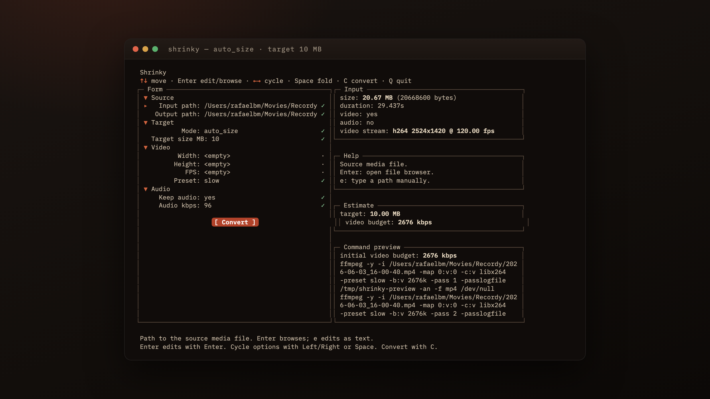
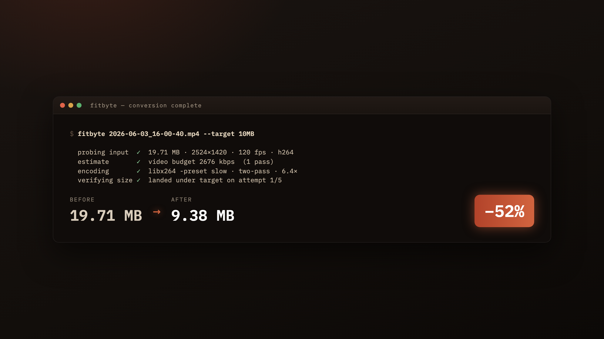

<!-- article:image-slot name="hero" -->
<picture>
  <source media="(prefers-color-scheme: dark)" srcset="docs/images/hero/image.png">
  <source media="(prefers-color-scheme: light)" srcset="docs/images/hero/image.png">
  
</picture>
<!-- /article:image-slot -->

I kept running into the same wall, and the wall kept being Discord. The free tier caps uploads at 10 MB, and ten megabytes is nothing for a gameplay clip: a minute of decent-resolution recording sails past that ceiling before you've finished the highlight. So you bounce off the upload, alt-tab to a browser, and start hunting for a converter. Those browser tools are a tax. Either you pay to skip a queue, you pay to strip a watermark, or you let the page push four banner ads while it uploads your file to someone else's server. `ffmpeg` already does everything those converters do, locally, for free, with no telemetry. The catch is the flag-googling, and picking a bitrate that lands close to a target size is its own little algorithm I'd run from memory enough times to be tired of it. So I wrote the thing I kept wanting: Fitbyte, a terminal media shrinker that does the size math for you.

## What Fitbyte Is

Fitbyte takes an audio or video file and a target size, then encodes an output that lands inside that budget. It's a single Python file with a curses TUI and a scriptable CLI, and its only dependency is `ffmpeg` (with `ffprobe`) on your `PATH`. Two interfaces share one engine: a curses front-end when you run it bare, and a flag-driven CLI when you want to script it. It is not a general file shrinker. Audio and video only: no images, no PDFs, no archives.

## Install

Requires Python 3.8+ and `ffmpeg` (with `ffprobe`) on `PATH`.

```bash
git clone https://github.com/rbmrs/fitbyte.git
cd fitbyte
ln -s "$PWD/app.py" ~/.local/bin/fitbyte
```

## Use

```bash
fitbyte              # launch the TUI
fitbyte --help       # CLI flags for scripts and pipelines
```

If you'd rather not touch a terminal, there's a native macOS shell in `macos/`. Prebuilt beta builds land on the [Releases page](https://github.com/rbmrs/fitbyte/releases) on every push to `main`; they're unsigned, so right-click `Fitbyte.app` and choose **Open** on first launch to get past Gatekeeper. It's a thin wrapper around the same engine, so everything below applies either way.

## How Auto-Size Works

The naïve formula for hitting a target file size is `bitrate = target_size / duration`. It's the first thing anyone tries, and it misses on two fronts. Containers carry overhead (headers, indexes, the small constant cost of being a `.mp4` instead of raw bits), so the bitrate you ask for and the size you get aren't the same number. And a single-pass constant-bitrate encode wanders around its average; ask for a 1000 kbps stream and you can land 5–10% over budget on complex scenes.

Fitbyte's auto-size loop is a small bisection on top of `ffmpeg` that absorbs both problems. The math comes first:

```
target_bytes = target_mb * 1_000_000
usable_bytes = target_bytes * 0.985            # leave 1.5% for container
total_kbps   = usable_bytes * 8 / duration / 1000
video_kbps   = total_kbps - audio_kbps
```

The 1.5% headroom on `usable_bytes` gives the container headers somewhere to live. Then a two-pass `libx264` encode does the work: `-pass 1` writes its stats to `/dev/null`, `-pass 2` uses those stats to spread bits across the timeline so a constant *average* bitrate produces a near-constant *file size*.

<!-- article:image-slot name="body-1" -->
<picture>
  <source media="(prefers-color-scheme: dark)" srcset="docs/images/1/image.png">
  <source media="(prefers-color-scheme: light)" srcset="docs/images/1/image.png">
  
</picture>
<!-- /article:image-slot -->

After pass 2, Fitbyte measures the real output. If it landed inside 96.5% to 100% of target, that's a hit. Otherwise it scales the bitrate by `target / actual`, re-applies the 0.985 margin, and reruns the two-pass, up to five attempts. In practice it converges in one or two; the cap is paranoia more than need. The 96.5% threshold isn't arbitrary either: `libx264`'s VBV behaviour tends to overshoot an exact target by 1–3%, and the headroom on the ask lands most inputs inside the budget on the first try.

Audio-only outputs are simpler. No two-pass is needed: a single-pass `libmp3lame` / `aac` / `libopus` encode runs under the same iterative bitrate-scaling loop. Lossless codecs (`pcm_s16le` for `.wav`, `flac` for `.flac`) refuse auto-size at validation. There's no bitrate knob to turn, so there's nothing the loop can do.

## Knobs You Can Turn

Auto-size answers the size question, but most of the time you want to nudge other things too, and the CLI flags group by the question they answer.

**How small?** `--target-size-mb`, a float, default 10. The whole point of the tool.

**How sharp?** `--width`, `--height`, and `--fps`. Set width alone and aspect ratio is preserved via `scale=W:-2`; the `-2` lets `libx264` pick an even height without you doing arithmetic. Fewer pixels means the encoder has fewer places to spend bits, which usually reads sharper at the same target size.

**How patient?** `--preset` with `medium`, `slow`, or `veryslow`, default `slow`. Slower presets buy better quality at the same bitrate by spending more CPU. There's no `ultrafast` on purpose: if you're chasing a size target, you want the encoder to actually try.

**What about audio?** `--audio-bitrate-kbps` to override the defaults (96 kbps for opus, 128 kbps elsewhere). `--no-audio` drops the track entirely, the cleanest way to save bits on a silent clip.

**Manual override?** `--mode manual` switches off the loop and hands you either `--crf` (default 23) for a quality-targeted encode or `--video-bitrate-kbps` for explicit bitrate. The two are mutually exclusive; setting both is an error.

`--dry-run` prints the assembled `ffmpeg` invocation and exits without encoding, good for a sanity check or for copy-pasting into a shell script. `--no-overwrite` errors instead of replacing an existing output. Three JSON modes (`--probe-json`, `--preview-json`, `--progress-json`) emit structured output for callers driving Fitbyte from another program.

## Why I Built It This Way

I already live in a terminal, so a GUI would have been a context switch, the kind you re-learn every time you haven't opened the app in a month. A terminal app fits where I already am, scripts cleanly into shell loops, and survives `ssh`. The TUI on top of the CLI is the same idea twice: a curses front-end makes one-off encodes pleasant, and the flag interface makes batch jobs just work. The reason it refuses online converters' whole premise is the same reason I wrote it: for anything personal, a recording or a clip with a friend in it, uploading to a stranger's box to dodge a size cap is a worse deal than the cap was.

<!-- article:image-slot name="body-2" -->
<picture>
  <source media="(prefers-color-scheme: dark)" srcset="docs/images/2/image.png">
  <source media="(prefers-color-scheme: light)" srcset="docs/images/2/image.png">
  
</picture>
<!-- /article:image-slot -->

## Things I'd Change

I'd reach for Textual over `curses` next time. Modern Python TUI frameworks hand you box-drawing, colors, mouse handling, and focus management for one dependency; the hours spent wiring layout primitives by hand would have gone further elsewhere. The five-attempt convergence cap was paranoid, since it almost always settles in one or two; three would do. Auto-size for `.webm` / VP9 would be a useful add, since right now auto-size is h264 only on the video side. And tests landed late: `tests/test_app.py` covers validation and the no-overwrite / auto-retry paths, but the pure functions that would have been easiest to pin first (`initial_auto_budgets`, `scale_bitrate`, the command builders) are still uncovered. Test-first would have saved real time.

## When to Reach for It

Good fit:

- You need to shrink an audio or video file under a platform upload cap.
- You want to batch-encode a folder with a shell loop and `--target-size-mb`.
- You're extracting audio-only output and want it inside a size budget.
- You already have `ffmpeg` installed and want to stop googling the right flags.

Not for:

- Lossless workflows: auto-size refuses lossless codecs at validation.
- File types outside the supported audio and video list. No PDFs, no images, no archives.
- VP9 or AV1 video in auto-size mode. Auto-size is h264 only today.
- GUI-only users. The macOS shell helps, but it's a thin wrapper around the same engine; if you won't touch a terminal at all, this isn't the tool.

## Built with Claude Code

This tool was designed, written, and iterated on with [Claude Code](https://claude.com/claude-code) as the primary author.

<!-- article:v1 -->
