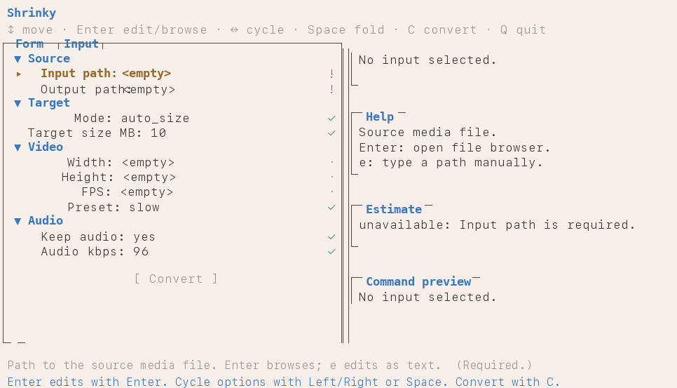

# Shrinky

Terminal media shrinker. Hit a target file size — or run a manual encode — without googling `ffmpeg` flags.

Backed by `ffmpeg` and `ffprobe`, driven from a curses TUI or a scriptable CLI.



## Install

Requires Python 3.8+ and `ffmpeg` (with `ffprobe`) on `PATH`.

```bash
git clone https://github.com/rbmrs/shrinky.git
cd shrinky
ln -s "$PWD/app.py" ~/.local/bin/shrinky
```

## Use

```bash
shrinky              # launch the TUI
shrinky --help       # CLI flags for scripts and pipelines
```

## macOS app (beta)

A native macOS shell lives in `macos/`. Prebuilt beta builds are on the
[Releases page](https://github.com/rbmrs/shrinky/releases) — each push to
`main` ships a new `Shrinky-<version>-macos.zip`.

The builds are unsigned: on first launch, right-click `Shrinky.app` and
choose **Open** to get past Gatekeeper.

To build it yourself:

```bash
scripts/build_macos_app.sh
open .build/debug/Shrinky.app
```

Set `SHRINKY_BACKEND=/path/to/app.py` if launching outside the repo.

## Built with Claude Code

Shrinky was built agentically — designed, written, and iterated on with [Claude Code](https://claude.com/claude-code) as the primary author.
