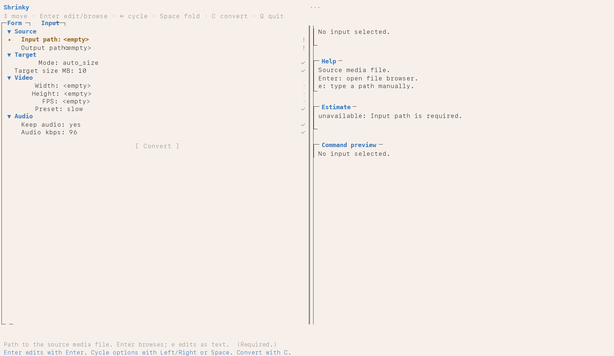
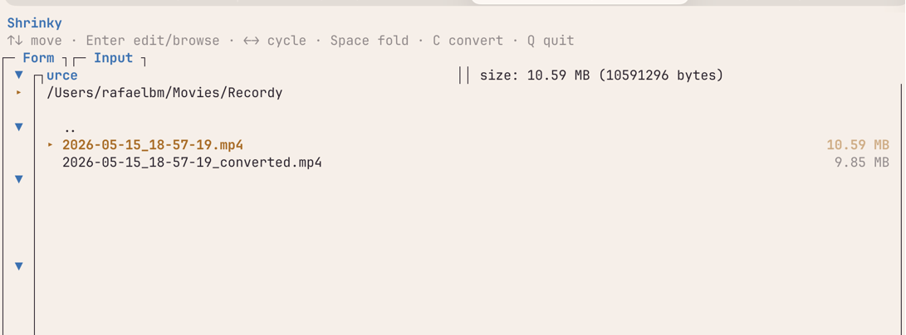
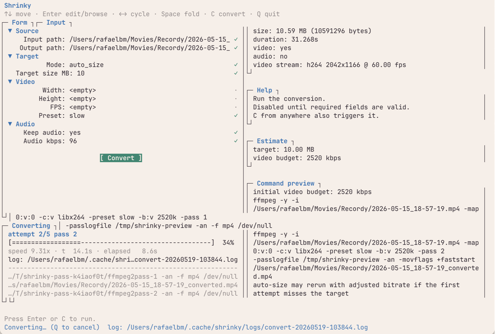

<!-- expander:v1 -->

<!-- expander:image-slot name="hero" -->
<picture>
  <source media="(prefers-color-scheme: dark)" srcset="docs/shrinky-tui-dark.png">
  <source media="(prefers-color-scheme: light)" srcset="docs/shrinky-tui-light.png">
  
</picture>
<!-- /expander:image-slot -->

## The 10 MB ceiling

I built Shrinky because I kept running into the same wall, and the wall kept being Discord. The free tier caps uploads at 10 MB. Ten megabytes is nothing for a gameplay clip: a minute of decent-resolution recording sails past that ceiling before you've finished the highlight you wanted to share. So you bounce off the upload, alt-tab to a browser, and start hunting for a converter.

The browser tools are a tax. Either you pay to skip a queue, or you pay to remove a watermark, or you let the page push four banner ads at you while it uploads your file to someone else's server. None of those options sat right with me. Worse, they're all the same story across every platform with a hard upload cap: Discord, WhatsApp, anywhere with a number above a "max size" label. The shape of the friction never changes, just the cap.

`ffmpeg` already does everything these converters do, locally, for free, with no telemetry. The catch is the flag-googling. Picking a bitrate that lands close to your target size is its own little algorithm, and I'd run it from memory enough times to be tired of running it from memory. So I wrote the thing I kept wanting: a terminal media shrinker that does the size math for me.

## What Shrinky is

Shrinky is a terminal app that takes an audio or video file and a target file size, and produces an output that lands inside that target. It's a single Python file (`app.py`, about a thousand lines) with no dependencies beyond `ffmpeg` and `ffprobe` on your `PATH`. Two interfaces share the same engine: a curses TUI when you run it bare, and a flag-driven CLI when you want to script it.

There are two modes. **auto-size** is the default: you give it a target in megabytes and it iterates the bitrate until the encoded output lands inside the budget. **manual** mode hands you the knobs (CRF or video bitrate, audio bitrate, resolution, fps, preset) and just builds the `ffmpeg` invocation for you. Both modes lean on `ffmpeg`'s actual encoders. Shrinky doesn't re-implement encoding, it makes the right command line easy to assemble.

It's not a general file shrinker. No PDFs, no images, no archives. Audio and video only.

## Install

Requires Python 3.8+ and `ffmpeg` (with `ffprobe`) on `PATH`.

```bash
git clone https://github.com/rbmrs/shrinky.git
cd shrinky
ln -s "$PWD/app.py" ~/.local/bin/shrinky
```

## Use

```bash
shrinky              # launch the TUI
shrinky --help       # CLI flags for scripts and pipelines
```

## macOS app (beta)

A native macOS shell lives in `macos/`. Prebuilt beta builds are on the
[Releases page](https://github.com/rbmrs/shrinky/releases): each push to
`main` ships a new `Shrinky-<version>-macos.zip`.

The builds are unsigned: on first launch, right-click `Shrinky.app` and
choose **Open** to get past Gatekeeper.

To build it yourself:

```bash
scripts/build_macos_app.sh
open .build/debug/Shrinky.app
```

Set `SHRINKY_BACKEND=/path/to/app.py` if launching outside the repo.

## How auto-size works

The naïve formula for hitting a target file size is `bitrate = target_size / duration`. It's the first thing anyone tries, and it misses on two fronts. Containers carry overhead (headers, indexes, the small constant cost of being a `.mp4` instead of raw bits), so the bitrate you ask for and the size you get aren't quite the same number. And a single-pass constant-bitrate encode produces wide variance around the average; you ask for a 1000 kbps stream and you can get a file that wanders 5–10% over the budget on complex scenes.

Shrinky's loop is a small bisection on top of `ffmpeg` to absorb both problems. The math comes first:

```
target_bytes = target_mb * 1_000_000
usable_bytes = target_bytes * 0.985            # leave 1.5% for container
total_kbps   = usable_bytes * 8 / duration / 1000
video_kbps   = total_kbps - audio_kbps
```

The 1.5% headroom on `usable_bytes` is the container budget: give the headers somewhere to live. Then a two-pass `libx264` encode does the work: `-pass 1` writes its stats to `/dev/null`, `-pass 2` uses those stats to spread bits across the timeline so the constant *average* bitrate produces a near-constant *file size*.

<!-- expander:image-slot name="how-it-works" -->
<picture>
  <source media="(prefers-color-scheme: dark)" srcset="docs/how-it-works-dark.png">
  <source media="(prefers-color-scheme: light)" srcset="docs/how-it-works-light.png">
  
</picture>
<!-- /expander:image-slot -->

After pass 2, Shrinky measures the actual output. If it landed inside 96.5% to 100% of target, that's a hit, and it's done. Otherwise, scale the bitrate by `target / actual` (re-applying the 0.985 safety margin) and rerun the two-pass. Up to five attempts. In practice it converges in one or two; the cap exists for paranoia more than for need.

The 96.5% threshold isn't arbitrary. `libx264`'s VBV behaviour means asking it for exactly your target tends to overshoot by 1–3%. A 1.5% headroom on the ask consistently lands inside the budget on the first try for most inputs, and the iteration handles the rest.

Audio-only outputs are simpler. No two-pass is needed: single-pass `libmp3lame` / `aac` / `libopus` with the same iterative bitrate-scaling loop on top. Lossless codecs (`pcm_s16le` for `.wav`, `flac` for `.flac`) refuse auto-size at validation time. There's no bitrate knob to turn, so there's nothing the loop can do.

## Knobs you can turn

Auto-size handles the size question, but most of the time you want to nudge other things too. The CLI flags group naturally by the question they answer.

**How small?** `--target-size-mb`, a float, default 10mb. The whole point of the tool.

**How sharp?** `--width`, `--height`, and `--fps`. Set width alone and aspect ratio is preserved via `scale=W:-2`; the `-2` lets `libx264` pick a height divisible by two without you doing arithmetic. Lower resolution gives the encoder fewer pixels to allocate bits to, which usually means a sharper-looking result at the same target size.

**How patient?** `--preset` with `medium`, `slow`, or `veryslow`. Default is `slow`. Slower presets squeeze better quality at the same bitrate by spending more CPU on the encode. There's no `ultrafast` here on purpose: if you're hitting a size target, you want the encoder to actually try.

**What about audio?** `--audio-bitrate-kbps` to override. Defaults are 96 kbps for `.opus`, 128 kbps elsewhere. `--no-audio` drops the audio track entirely, which is the cleanest way to save bits when the clip is silent or you only care about the video.

**Manual override?** `--mode manual` switches off the auto-size loop. From there you supply either `--crf` (default 23) for quality-targeted encoding, or `--video-bitrate-kbps` for explicit bitrate control. The two are mutually exclusive; setting both is an error.

**Show me, don't run it.** `--dry-run` prints the assembled `ffmpeg` invocation and exits without encoding. Good for sanity checks, good for copy-pasting into a shell script when you want to keep the command but not the wrapper.

**Don't clobber.** `--no-overwrite` errors instead of replacing an existing output file.

There are three JSON output modes (`--probe-json`, `--preview-json`, `--progress-json`) for callers that want structured output instead of human-readable progress. Useful if you're driving Shrinky from another program.

## Why I built this

Three things converged. First, the file-cap problem genuinely doesn't go away. Discord's 10 MB free-tier limit is the one that finally tipped me, but WhatsApp's 16 MB and Twitter's 512 MB sit on the same shelf. Every platform with a hard ceiling will, at some point, refuse a file you wanted to send. Solving that once and reusing the solution forever felt overdue.

Second, the alternatives bothered me. Online converters are an ecosystem of ads, paywalls, and "fast-track" upsells, and they require you to upload your video to a stranger's box before they'll touch it. For anything personal (a recording, a clip with a friend in it, a screen capture of something private), that's a worse deal than the cap was.

<!-- expander:image-slot name="why" -->
<picture>
  <source media="(prefers-color-scheme: dark)" srcset="docs/why-dark.png">
  <source media="(prefers-color-scheme: light)" srcset="docs/why-light.png">
  
</picture>
<!-- /expander:image-slot -->

Third, I already live in a terminal. A GUI for this would be a context switch, and the kind of context switch that needs to be re-learned every time you haven't used the app for a month. A terminal app fits where I already am, scripts cleanly into shell loops, and survives `ssh`. The TUI on top of the CLI is the same idea twice: a curses front-end makes one-off encodes pleasant, and the flag interface makes batch jobs and pipelines just work.

I built Shrinky agentically: designed, written, and iterated on with Claude Code as the primary author. That isn't a gimmick, it's how the tool got made. The shape it landed in is a product of that collaboration as much as it is of the problem.

Stripped down: what Shrinky really is, is a compilation of `ffmpeg` flags it runs for you to hit a target file size. The thing you would have typed by hand if you remembered the exact incantation. Now you don't have to.

## Things I'd change

I'd probably reach for Textual over `curses` if I were starting again. Modern Python TUI frameworks give you box-drawing, colors, mouse handling, and focus management for free, at the cost of one dependency. `curses` is fine, but the time spent wiring layout primitives by hand would have been better spent elsewhere.

The bitrate-scaling loop almost always converges in one or two iterations. The five-attempt cap was paranoid; three would do. Auto-size for `.webm` / VP9 would be a useful add; right now auto-size is h264 only on the video side.

Tests landed late. `tests/test_app.py` covers validation and the no-overwrite / auto-retry paths, but the pure functions that would have been easiest to pin down first (`initial_auto_budgets`, `scale_bitrate`, the command builders) are still uncovered. Test-first would have saved real time.

## When to reach for it

Good fit:

- You need to shrink an audio or video file under a platform upload cap.
- You want to batch-encode a folder with a shell loop and `--target-size-mb`.
- You're extracting audio-only output and want it inside a size budget.
- You already have `ffmpeg` installed and want to stop googling the right flags.

Not for:

- Lossless workflows: auto-size refuses lossless codecs at validation.
- File types outside the supported audio and video list. No PDFs, no images, no archives.
- VP9 or AV1 video in auto-size mode. Auto-size is h264 only today.
- GUI-only users. The macOS shell helps, but it's a thin wrapper around the same engine; if you don't want to touch a terminal at all, this is not the tool.

## Built with Claude Code

This tool was designed, written, and iterated on with [Claude Code](https://claude.com/claude-code) as the primary author.
